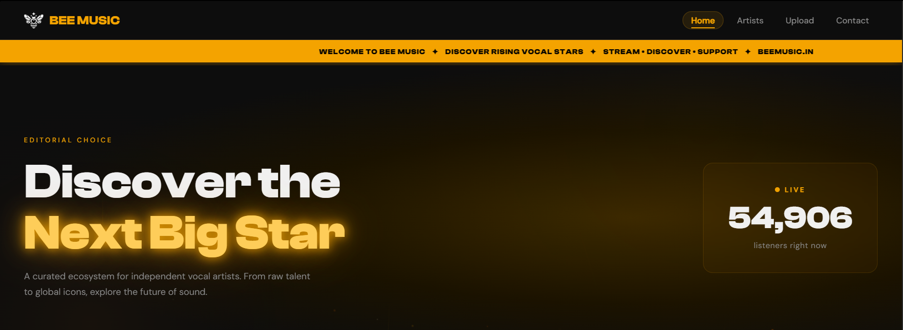
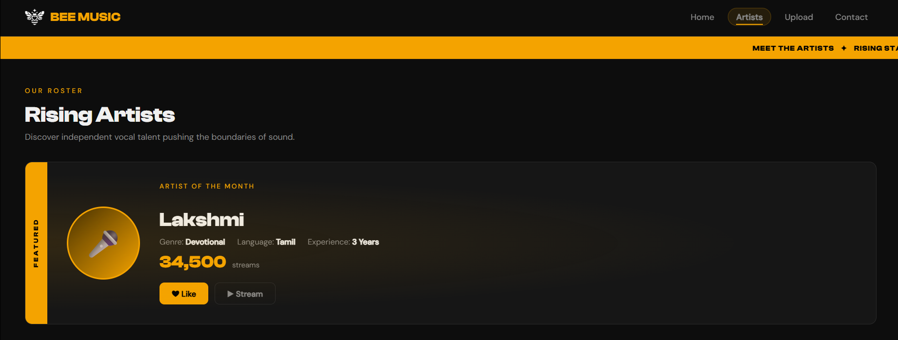
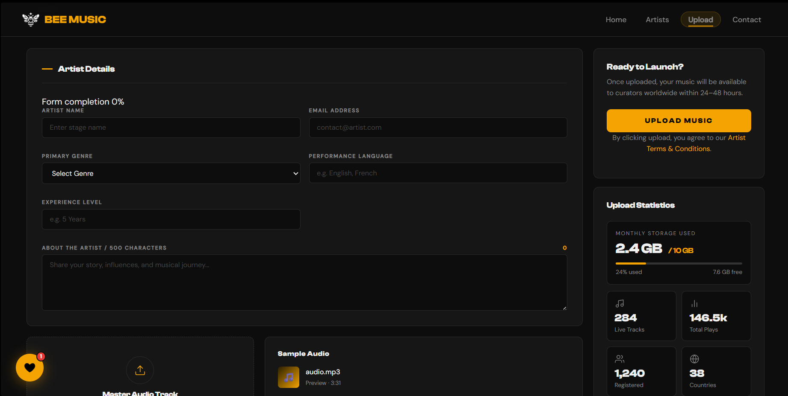
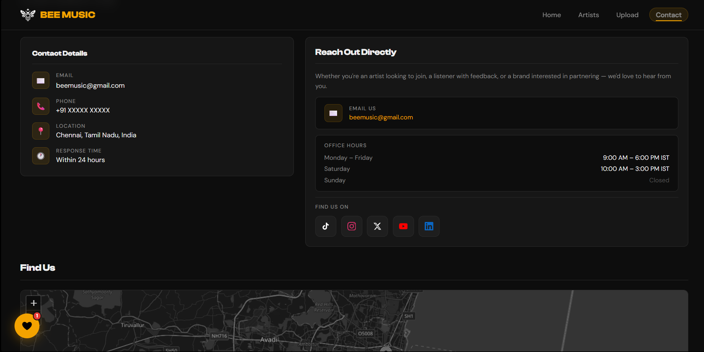
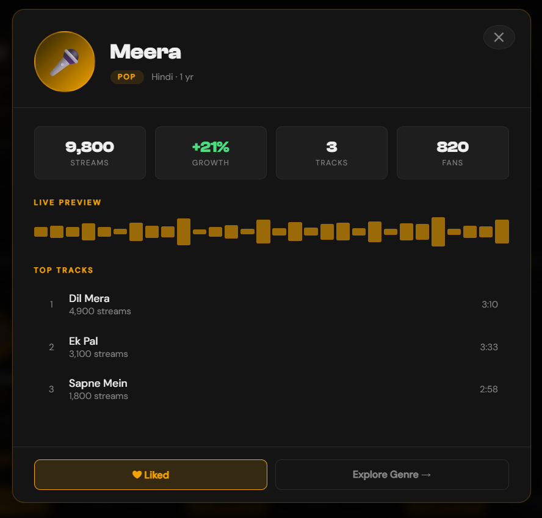
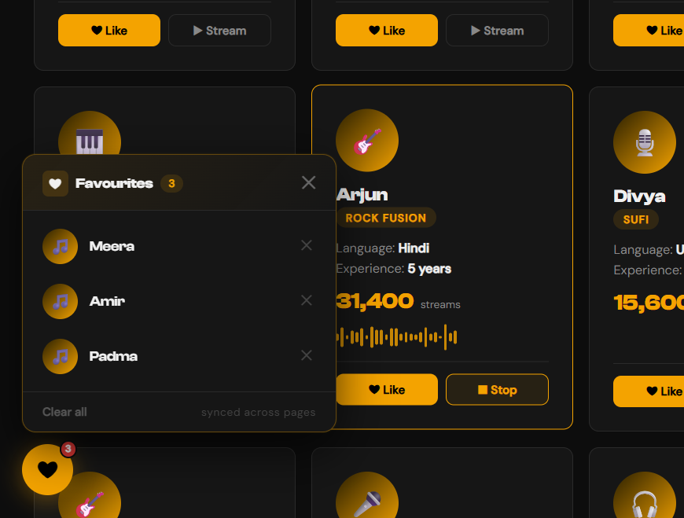

#  BeeMusic — Music Discovery Platform

BeeMusic is a frontend web application designed to simulate a modern music discovery platform. It allows users to explore artists, browse genres, and interact with dynamic UI elements in an engaging and visually rich environment.
---

## 🌐 Live Demo

🔗 https://sid-skippy.github.io/BeeMusic/

---

## 📸 Preview Images

<p align="center">
  
  
</p>

---

## 🚀 Features

* Artist Exploration Explore and interact with artist cards in a clean and modern design

* Genre-Based Navigation Explore artists categorized under various types of music genres

* Save your favorite artists using localStorage

* Upload Interface (Prototype) A simulated upload interface to demonstrate user interaction flow

* Search & Filtering Find an artist using our inbuilt search functionality

* Modern UI/UX Design Consistent design, animations, and layout

<p align="center">
  
  
</p>

---

## 🛠️ Tech Stack

* HTML5
  
* CSS3
  
* JavaScript (Vanilla JS)

---

## ⚠️ Note

This project is a **frontend prototype**.
No backend or database is used. Data (such as liked artists) is stored in the browser using localStorage.

---

## 📁 Project Structure

```
index.html
artists.html
genre.html
upload.html
contact.html
style.css
liked-artists.js
logo.png
audio.mp3
```

---

## 🎯 Purpose

This project was developed as part of a Web Development course to demonstrate:

* Frontend design principles

* User interaction and state handling

* Clean UI/UX implementation

---

## 🙌 Acknowledgment

Built as a student project to explore modern web development concepts and create a realistic user experience without backend integration.
